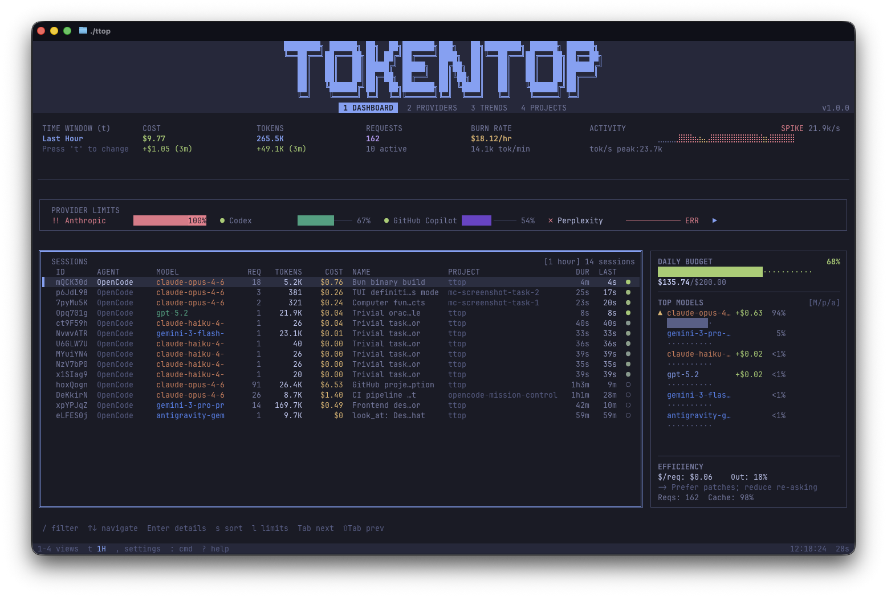

 > **Early release** — tokentop is functional and actively developed. Please [report issues](https://github.com/tokentopapp/tokentop/issues)!

<div align="center">

# tokentop

**htop for your AI costs**

Real-time terminal monitoring of LLM token usage and spending across providers and coding agents.



[](https://github.com/tokentopapp/tokentop/actions)
[](LICENSE)
[](https://github.com/tokentopapp/tokentop/releases)
[](https://www.typescriptlang.org/)
[](https://bun.sh)
[](https://visitorbadge.io/status?path=https://github.com/tokentopapp/tokentop)

[Features](#features) · [Install](#installation) · [Quick Start](#quick-start) · [Agents](#agents) · [Plugins](#plugin-system) · [Docs](https://tokentop.app/docs/getting-started/)

**[tokentop.app](https://tokentop.app)**

</div>

---

## Why tokentop?

You're coding with AI agents all day. Claude Code, OpenCode, Cursor, Copilot CLI — they're burning through tokens and you have no idea how fast.

You check the Anthropic dashboard. It's hours behind. You check OpenAI. Different dashboard, different login. Want to see it all in one place? In real time? In your terminal, where you already live?

That's tokentop.

- See every session, every model, every dollar — **live**
- Track costs across **11 providers** from a single dashboard
- Set **budget alerts** so you don't wake up to a surprise bill
- Runs **100% locally** — your usage data never leaves your machine

## Demo

<https://github.com/user-attachments/assets/0b0225c7-a137-454b-9b29-c858cdcbd86c>

## Features

- **Real-time dashboard** — Live token counts, costs, burn rate, and activity sparklines
- **11 providers** — Anthropic, OpenAI, Google Gemini, GitHub Copilot, Codex, Perplexity, Antigravity, MiniMax, Zai, OpenCode Zen, Chutes
- **7 coding agents** — Claude Code, OpenCode, Cursor, Copilot CLI, Gemini CLI, Antigravity, and Windsurf. See every session with model, tokens, cost, and duration
- **Budget guardrails** — Daily, weekly, and monthly limits with visual warnings at limit percentages you set
- **Smart sidebar** — Adaptive panel that breaks down spending by model, project, or agent
- **Efficiency insights** — Cache leverage, output verbosity, and cost-per-request analysis to help you spend less
- **Historical trends** — ASCII step charts showing cost patterns over 7, 30, or 90 days
- **Projects view** — See which codebase is costing you the most
- **Provider limits** — Visual gauges showing how close you are to rate limits
- **Live pricing** — Fetches current model pricing from [models.dev](https://models.dev) with local caching
- **[15 built-in themes](https://tokentop.app/docs/themes/built-in/)** — Tokyo Night, Dracula, Nord, Catppuccin, Gruvbox, Rosé Pine, Kanagawa, and more. Dark and light variants. Create your own with the [theme plugin API](https://tokentop.app/docs/themes/custom-themes/)
- **Plugin system** — Extend with custom providers, agents, themes, and notifications
- **Responsive layout** — Adapts to any terminal size; sidebar, KPI strip, header, and tables all reflow automatically from ultrawide to laptop-width
- **Demo mode** — Explore the UI with synthetic data, no API keys needed
- **Zero config** — Auto-discovers credentials from Claude Code, OpenCode, Cursor, Copilot CLI, Gemini CLI, environment variables, and CLI auth files

## Installation

### Homebrew (macOS/Linux)

```bash
brew install tokentopapp/tap/tokentop
```

### Install script (macOS/Linux)

```bash
curl -fsSL https://raw.githubusercontent.com/tokentopapp/tokentop/main/scripts/install.sh | sh
```

### Scoop (Windows)

```powershell
scoop bucket add tokentop https://github.com/tokentopapp/scoop-tokentop
scoop install tokentop
```

### Standalone binaries

Download the latest binary for your platform from [GitHub Releases](https://github.com/tokentopapp/tokentop/releases). No dependencies required.

| Platform | Binary |
|----------|--------|
| macOS (Apple Silicon) | `ttop-darwin-arm64` |
| Linux (x64) | `ttop-linux-x64` |
| Linux (ARM64) | `ttop-linux-arm64` |
| Windows (x64) | `ttop-windows-x64.exe` |

### npm

Requires [Bun](https://bun.sh) runtime. If Bun is installed, this works out of the box. If not, it will tell you how to get it.

```bash
bunx @tokentop/ttop
# or install globally
bun install -g @tokentop/ttop
```

### From source

```bash
git clone https://github.com/tokentopapp/tokentop.git
cd tokentop
bun install
bun start
```

## Quick Start

```bash
# Launch tokentop
bun start
# or, if installed globally:
ttop

# Try it without any API keys
ttop demo

# Pick a theme
ttop -t dracula

# Deterministic demo for screenshots/testing
ttop demo --seed 42 --preset heavy
```

tokentop will automatically discover your credentials. If you use Claude Code, your OAuth tokens are picked up immediately — no configuration needed.

## Views

tokentop has 4 main views, switchable with `1`–`4`:

| Key | View | What it shows |
|-----|------|---------------|
| `1` | **Dashboard** | KPI strip, activity sparkline, provider limits, sessions table, smart sidebar |
| `2` | **Providers** | All configured providers with connection status and usage levels |
| `3` | **Trends** | ASCII step charts of cost over 7/30/90 days |
| `4` | **Projects** | Cost and token breakdown by local project/repo |

## Agents

tokentop tracks sessions from 7 coding agents. Each agent is a standalone plugin — built-in agents ship with the app, community agents install from npm.

| Agent | What it tracks | Plugin |
|-------|---------------|--------|
| [Claude Code](https://tokentop.app/docs/agents/claude-code/) | Sessions, OAuth tokens, multi-provider usage | [`@tokentop/agent-claude-code`](https://github.com/tokentopapp/agent-claude-code) |
| [OpenCode](https://tokentop.app/docs/agents/opencode/) | Sessions, OAuth credentials, multi-provider support | [`@tokentop/agent-opencode`](https://github.com/tokentopapp/agent-opencode) |
| [Cursor](https://tokentop.app/docs/agents/cursor/) | Sessions, CSV server log enrichment | [`@tokentop/agent-cursor`](https://github.com/tokentopapp/agent-cursor) |
| [Copilot CLI](https://tokentop.app/docs/agents/copilot-cli/) | Sessions, GitHub token auth | [`@tokentop/agent-copilot-cli`](https://github.com/tokentopapp/agent-copilot-cli) |
| [Gemini CLI](https://tokentop.app/docs/agents/gemini-cli/) | Sessions, Google OAuth | [`@tokentop/agent-gemini`](https://github.com/tokentopapp/agent-gemini) |
| [Antigravity](https://tokentop.app/docs/agents/antigravity/) | Sessions, Google OAuth | [`@tokentop/agent-gemini`](https://github.com/tokentopapp/agent-gemini) |
| [Windsurf](https://tokentop.app/docs/agents/windsurf/) | Sessions, Codeium auth | [`@tokentop/agent-windsurf`](https://github.com/tokentopapp/agent-windsurf) |

All agents are auto-discovered — if you have the tool installed, tokentop finds it. See the [agent docs](https://tokentop.app/docs/agents/) for details.

## Keyboard Shortcuts

### Global

| Key | Action |
|-----|--------|
| `1`–`4` | Switch views |
| `,` | Settings |
| `:` | Command palette |
| `r` | Refresh all providers |
| `?` | Help overlay |
| `q` | Quit |

### Dashboard

| Key | Action |
|-----|--------|
| `t` | Cycle time window (5m → 15m → 1h → 24h → 7d → 30d → all) |
| `/` | Filter sessions (by agent, model, project) |
| `s` | Cycle sort (cost, tokens) |
| `j`/`k` or `↑`/`↓` | Navigate sessions |
| `Enter` | Open session details |
| `Tab`/`Shift+Tab` | Cycle focus (sessions → limits → sidebar) |
| `i` | Toggle sidebar |
| `m`/`p`/`a` | Sidebar dimension (model / project / agent) |
| `b` | Cycle budget lock (sync with window, daily, weekly, monthly) |
| `l` | Jump to provider limits |
| `gg`/`G` | Jump to top/bottom |

## Configuration

Config lives at `~/.config/tokentop/config.json`:

```jsonc
{
  "theme": "tokyo-night",          // 15 themes — see ttop --help for full list
  "colorScheme": "auto",           // auto, light, dark
  "refreshInterval": 60000,        // polling interval (ms)
  "budgets": {
    "daily": 50.00,
    "weekly": 200.00,
    "monthly": 500.00
  }
}
```

Settings are also editable in-app — press `,` to open the settings panel.

### Credential Discovery

tokentop finds your API credentials automatically — no manual key entry needed.

**Discovery order:**

1. **OpenCode / Claude Code auth** — Reads OAuth tokens from `~/.local/share/opencode/auth.json` (supports Anthropic OAuth, OpenAI/Codex OAuth, GitHub tokens, and well-known API keys)
2. **Antigravity accounts** — Picks up Google/Gemini OAuth from `~/.config/opencode/antigravity-accounts.json`
3. **Environment variables** — `ANTHROPIC_API_KEY`, `OPENAI_API_KEY`, `GEMINI_API_KEY`, etc.
4. **External CLI auth** — Claude Code, Gemini CLI, and other tool auth files

OAuth tokens are preferred over API keys because provider usage-tracking APIs (like Anthropic's `/api/oauth/usage`) require OAuth, not API keys. If you use Claude Code or OpenCode, your tokens are picked up immediately.

## Plugin System

tokentop is built on a plugin architecture with four extension points:

| Type | Purpose | Official | Community |
|------|---------|----------|-----------|
| **Provider** | Add a model provider | `@tokentop/provider-*` | `tokentop-provider-*` |
| **Agent** | Support a coding agent | `@tokentop/agent-*` | `tokentop-agent-*` |
| **Theme** | Custom color schemes | `@tokentop/theme-*` | `tokentop-theme-*` |
| **Notification** | Alert delivery (Slack, Discord, etc.) | `@tokentop/notification-*` | `tokentop-notification-*` |

All plugins run in a **permission sandbox** — they must declare network, filesystem, and environment access upfront. Anyone can publish community plugins to npm — no org membership needed.

See the [Plugin Guide](https://tokentop.app/docs/plugins/overview/) for installation, configuration, and development details.

## How It Works

tokentop combines two data sources for real-time visibility:

1. **Provider API polling** — Fetches usage data directly from provider APIs (Anthropic, OpenAI, etc.) on a configurable interval
2. **Local session parsing** — Watches your coding agent's session files on disk via `fs.watch`, computing token deltas in real time as you code

Costs are calculated from token counts and live pricing data from [models.dev](https://models.dev) (cached 1 hour), with built-in fallback pricing for offline use.

All data is stored in a **local SQLite database**. Nothing is sent anywhere. No telemetry, no analytics, no network calls except to the provider APIs you've already authenticated with.

## Alternatives

| Tool | Approach | Tokentop Difference |
|------|----------|---------------------|
| Provider dashboards | Web, hours behind | Real-time, in terminal |
| [tokentap](https://github.com/nicholasgasior/tokentap) | MitM proxy (abandoned) | Native API polling, no proxy |
| [toktop](https://github.com/jnsahaj/toktop) | Rust TUI, 2 providers | 11 providers, 7 agents, plugins |
| [sniffly](https://github.com/chiphuyen/sniffly) | Python dashboard | Terminal-native, multi-agent |

## Development

```bash
bun install          # Install dependencies
bun run dev          # Dev mode with hot reload
bun test             # Run tests
bun run typecheck    # TypeScript check
bun run lint         # Biome
```

### Demo mode for development

```bash
ttop demo                          # Random synthetic data
ttop demo --seed 42                # Deterministic (reproducible)
ttop demo --preset heavy           # High activity simulation
ttop demo --seed 42 --preset light # Combine both
```

### Built with

- [Bun](https://bun.sh) — Runtime
- [OpenTUI](https://github.com/anthropics/opentui) — Terminal UI framework (React reconciler)
- [TypeScript](https://www.typescriptlang.org/) — Strict mode
- [SQLite](https://www.sqlite.org/) — Local storage via `bun:sqlite`

## Contributing

Contributions welcome! Please open an issue first to discuss what you'd like to change.

- **Conventional commits**: `feat:`, `fix:`, `docs:`, `refactor:`
- **TypeScript strict mode** — no `any`, no `@ts-ignore`
- **Tests required** for new features

## License

[MIT](LICENSE)
